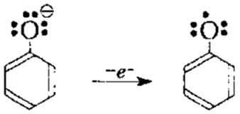

# Фенол
> Фенолами называются производные ароматических углеводородов, в молекулах которых одна или несколько гидроксильных групп связаны с ароматическим кольцом.

### 1. Строение
Неподеленная электронная пара атома кислорода взаимодействует с ароматической системой из0за этого:
	1. Увеличивается электронная плотность на ароматической системе, происходит её перераспределение, и на атомах 2,4,6 появляется избыточный отрицательный заряд
		2. Электронная пара связи O-H смещается к атому кислорода и связь становится менее прочной по сравнению со спиртами
		3. Увеличивается прочность связи атома кислорода с атомом углерода, входящим в ароматическое кольцо, и гидроксогруппа не способна к реакциям замещеня

### 2. Физические свойства
Фенол ядовит, бесцветное легкоплавкое кристаллическое вещество, обладающее характерным запахом, легко окисляется кислородом воздуха, при хранении темнеет, мало растворим в холодной воде, хорошо в горячей.
	
### 3. Химические свойства
	- Свойства очень слабой кислоты

- Реакции по бензольному кольцу 
Гидроксильная группа увеличивает реакционную способность ароматического кольца и ориентирует вступающие заместители в орто- и пара- положения. 
   - Галогенирование. Электрофильное замещение
			- Образование трибромфенола - белого осадка
   - Нитрование 
		- разбавленной - смесь изомерных нитрофенолов
		- тринитрофенол - желтый осадок - пикриновая кислота
			- Фенол растворяют в серной кислоте, на сульфокислоту действуют концентрированной азотной при нагревании реакционной смеси кипящей водой
   - Сульфирование 
			- При комнатной температуре преобладает орто- изомер, при 100 пара-фенолсульфокислота
   - Образование фенолформальдегидной смолы "Поликонденсация"

   - Алкилирование
   - Гидрирование
- Реакции с участием гидроксильной группы
			_Кислотные свойства фенола_ 
   - Диссоциация C6H5OH--C6H5O+H
			- Электронодонорные заместители (СH3, NH2) ослабляют кислотные свойства, а электроноакцепторные (NO2, CHO) - усиливают. 
   - Взаимодействие с щелочными металлами 
   - Взаимодействие с щелочами 
	
		- Получение простых эфиров взаимодействием галогеналканов на фенолятнатрия 
		- Получение сложных эфиров при действии на феноляты ангидридов или галогенангидридов кислот

- **Качественная реакция** - взаимодействие с хлоридом железа - фиолетовое окрашивание, сам хлорид железа желтый

- Окисление
		Механизм:
		Окисление фенола характеризуется сложным характером и происходит преимущественно по радикальному механизму. При этом в результате перехода электрона к окислителю возникает катион-радикал, который после отщепления протона превращается в феноксильний радикал:

***	
Феноксил-радикал может легко образовываться также при окислении фенолят-аниона:
***		
	
В феноксильних радикалах неспаренный электрон в значительной степени делокализованных системой π-связей ароматического ядра, можно показать набором резонансных структур:

Феноксильний радикал способен к реакциям рекомбинации или других преобразований:

В случае размещения в ядре объемных заместителей возможно образование устойчивых феноксильных радикалов. Стабильность таких радикалов объясняется не столько рассредоточением исспареного электрона в ароматическом ядре, сколько экранированием алкильными группами в о- положениях реакционного центра на атоме кислорода, то есть кинетической стабильностью. Например, при окислении 4-метил-2,6-ди-трет-бутилфенол (ионола) образуется стабильный радикал, который может значительное время существовать в свободном состоянии:

- CrO3 - в п-бензохинон

			Именно появлением хиноидного строения обусловлена окраска фенолов в процессе спонтанного окисления во время их хранения
- H2O2 с Fe - в пирокатехин

			
### 4. Применение
- Антисептик с 1867 года Листер
- Консервирование лекарственных средств и сывороток
- Синтез лекарственных средств 
- Полифенольные вещества растительного происхождения эффективно снижают концентрацию свободных радикалов в организме, предохраняя мембраны от окисления
	
	- Флавоноиды - например кверцетин - фитопрепарат антиоксидантного действия 
- Взрывчатые вещества
- Фенолформальдегидная смола(древесная стружка, фенопласты)
- Взрывчатые вещества
