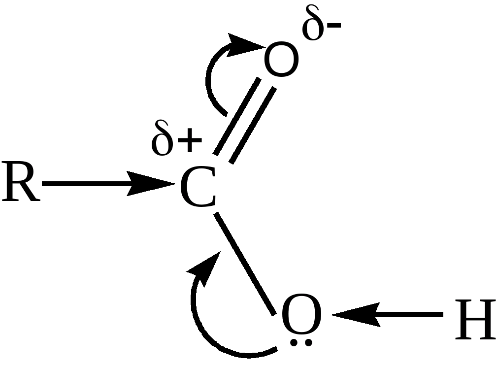
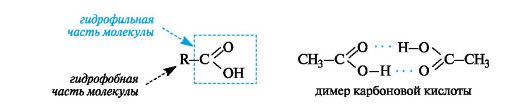
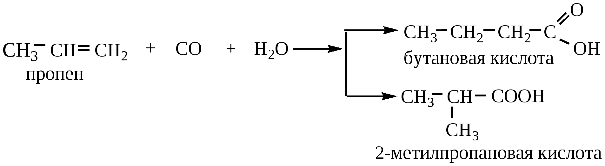

### Карбоновые кислоты
> Карбоновые кислоты - органические вещества, в молекулах которых содержится одна или несколько карбоксильных групп, соединенных с углеводородным радикалом или атомом водорода.

Классификация 
1. По числу карбоксильных групп(одноосновные и многоосновные)
2. По природе углеводородного радикала(предельные, непредельные, ароматические)
### 1. Строение
1. Атом углерода в состоянии sp2 гибридизации 
2. Связь с=о поляризована, и на атоме углерода имеется частичный положительный заряд
3. Неподеленная пара электронов атома кислорода вступает в сопряжение с группой с=о, в результате связь о-h дполнительно поляризуется и ослабевает
4. Карбоксильная группа проявляет  сильный отрицательный индукционный эффект и облегчает замещение атома водорода в альфа-положении
5. Для карбонильных кислот характерно существование межмолекулярных водородных связей, поэтому температуры кипения кислот выше, чем у соответствующих им альдегидов и спиртов, а также изомерных сложных эфиров

***
Незамещенные одноосновные карбоновые кислоты - слабые электролиты 
Электроноакцепторные заместители увеличивают положительный заряд на атоме углерода и усиливают кислотные свойства
Электронодонорные заместители ослабляют силу карбоновых кислот
***
### 2. Изомерия 
1. Изомерия углеродной цепи
2. Изомерия положения кратной связи (для ненасыщенных кислот)
3. Межклассовая изомерия (со сложными эфирами)
### 3. Физические свойства
Карбоновые кислоты, благодаря карбоксильной группе, полярны и могут участвовать в образовании межмолекулярных водородных связей. Такими связями с молекулами воды объясняется неограниченная растворимость низших кислот (C1-C4) в воде и спирте. Высшие кислоты в воде растворяются плохо. Хорошо растворяются в этиловом спирте и диэтиловом эфире. Это связано с гидрофобными свойствами УВ-радикала в кислоте: чем больше масса радикала, тем меньше кислота растворима в воде.

Низшие кислоты – бесцветные, резко пахнущие жидкости, начиная с пентановой (валериановой) кислоты – маслянистые жидкости, высшие кислоты -  твердые вещества без вкуса и запаха. 

Для карбоновых кислот характерна межмолекулярная ассоциация. Так, жидкие карбоновые кислоты, например уксусная кислота, существуют в виде димеров. В водных растворах димеры распадаются на мономеры.

Основные карбоновые кислоты 
- Одноосновные

- Двухосновные кислоты

### 4. Химические свойства
- Общие свойства 
  - Электролитическая диссоциация 
  - Взаимодействие с металлами, находящимися в ряду активности левее водорода
  - Взаимодействие с основными оксидами 
  - Взаимодействие с основаниями 
  - Взаимодействие с солями более слабых или более летучих кислот

- Получение функциональных производных
  - Взаимодействие со спиртами - получение сложных эфиров

   - Образование галогенангидридов при взаимодействии с PCl~5~

   - Реакция с PCl~3~
_PCl~3~+CH3COOH=CH3COCl+H3PO3_
   - Образование ангидридов при нагревании с водоотнимающими средствами (кроме HCOOH)

   - Образование амидов при нагревании с аммиаком
   - Образование жиров(сложные эфиры глицерина и высших карбоновых кислот)

- Реакции по углеводородным радикалам
    - Галогенирование по альфа положению (Красный фосфор)
    - Присоединение по кратным связям для непредельных кислот
       - Гидрирование непредельных кислот
       - Присоединение галогенов
       - Присоединение галогеноводородов и воды (для акриловой кислоты происходит не по правилу Марковникова)
       - Реакции полимеризации 

    - Электрофильное замещение в мета-положение ароматического кольца для ароматических кислот(бензойная кислота с азотной)
    - Горение в кислороде
### 5. Получение 
- Обшие способы получения 
   - Взаимодействие солей карбоновых кислот с сильными кислотами 
   - Окисление альдегидов и первичных спиртов
   - Реакции гидролиза 
      - Гидролиз 1,1,1-тригалогензамещенных  
      - Гидролиз сложных эфиров 
      - Гидролиз ангидридов кислот
  _(CH3CO)2O+H2O=CH3COOH_
     - Гидролиз галогенангидридов или амидов кислот
     - Гидролиз нитрилов (лень писать про это лол)
   - Использование металлорганических соединений(С реактивом Гриньяра)

   - Оксосинтез 

- Специфические способы получения некоторых кислот 
    - Окисление метана(получение муравьиной кислоты)
    - Окисление н-бутана(в этановую кислоту)
    - Получение муравьиной кислоты синтезом

   - Окисление аренов

### 6. Применение 
- Органический синтез
- Мыло, фунгициды, катализаторы, 
- Эфиры кислот - пищевые добавки
- Пластмассы и лаки

- Муравьиная кислота является сильным восстановителем и обладает сильным бактерицидным эффектом. На этих свойствах основано её применение в медицине, как консервант и для дезинфекции. Также применяется для обработки кожи и отделке текстиля и бумаги.
- Уксусная кислота — в пищевой и химической промышленности (производство ацетилцеллюлозы, из которой получают ацетатное волокно, органическое стекло, киноплёнку; для синтеза красителей, медикаментов и сложных эфиров). В домашнем хозяйстве как вкусовое и консервирующее вещество. В промышленности — растворитель лаков, коагулянт латекса, ацетилирующий агент
- Масляная кислота — для получения ароматизирующих добавок (эфиры метилбутират и изоамилбутират — ароматизаторы в промышленности), пластификаторов и флотореагентов, как экстрагент щелочно-земельных металлов

- Щавелевая кислота — в металлургической промышленности (удаление окалины), в качестве протравы при крашении, для отбелки соломы, при приготовлении чернил, как реагент в аналитической органической химии

- Стеариновая C17H35COOH и пальмитиновая кислоты C15H31COOH — в качестве поверхностно-активных веществ (натриевая соль), смазочных материалов в металлообработке, как компонент и эмульгатор кремов и мазей. Эфиры — антиоксиданты, стабилизаторы пищевых продуктов, компоненты клеящих паст и для обработки текстиля и кожи.

Олеиновая кислота C17H33COOH — флотореагент при обогащении руд цветных металлов.