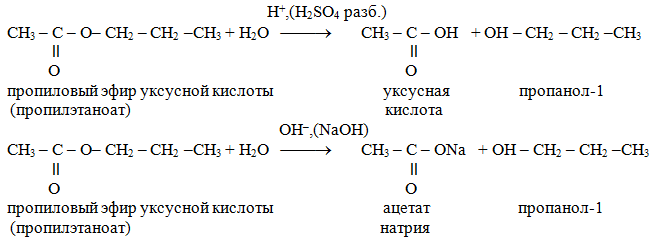
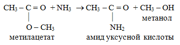
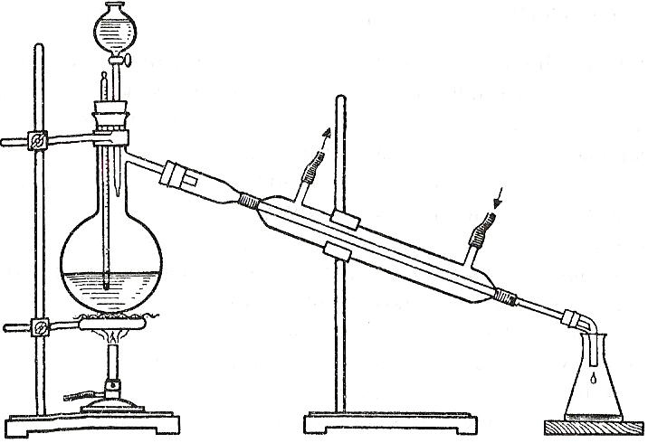
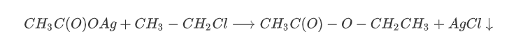
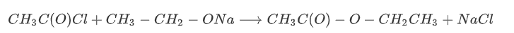
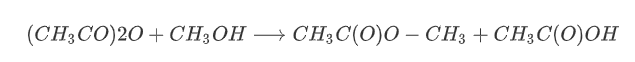
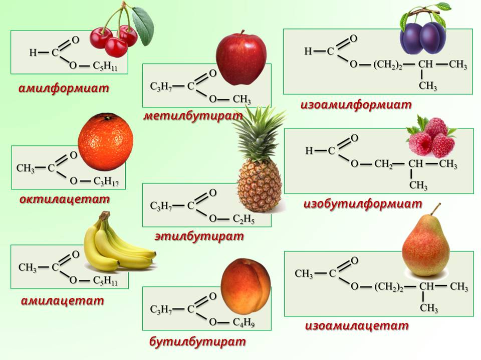

# Сложные эфиры 
*** 
> **Сложные эфиры** - производные карбоновых кислот, у которых атом водорода карбоксильной группы замещен углеводородным радикалом.

Общая формула R-COOR

Классификация
- Фруктовые эфиры — жидкости с фруктовым запахом, молекула содержит не более восьми атомов углерода. Получают из одноатомных спиртов и карбоновых кислот. Эфиры с цветочным запахом получают с помощью ароматических спиртов.
- Воски — твердые вещества, содержат в молекуле от 15 до 45 атомов С.
- Жиры — содержат в молекуле 9-19 атомов углерода. Получают из глицерина (трехатомного спирта) и высших карбоновых кислот. Жиры могут быть жидкими (растительные жиры, называемые маслами) и твердыми (животные жиры).
- Сложные эфиры минеральных кислот по своим физическим свойствам тоже могут быть как маслянистыми жидкостями (до 8 атомов углерода), так и твердыми веществами (от девяти атомов C).
### 1. Строение 

### 2. Изомерия
1. Изомерия углеродной цепи (углеродного скелета) начинается по кислотному остатку с бутановой кислоты, по спиртовому остатку — с пропилового спирта, например, этилбутирату изомерны этилизобутират, пропилацетат и изопропилацетат.

2. Изомерия положения сложноэфирной группировки —С(О)—О—. Этот вид изомерии начинается со сложных эфиров, в молекулах которых содержится не менее 4 атомов углерода, например этилацетат и метилпропионат.

3. Межклассовая изомерия с карбоновыми кислотами

Для сложных эфиров, содержащих непредельную кислоту или непредельный спирт, возможны еще два вида изомерии: изомерия положения кратной связи и геометрическая (цис-, транс-) изомерия.
### 3. Физические свойства
Сложные эфиры  низших карбоновых кислот и простейших спиртов - бесцветные летучие жидкости, часто с приятным фруктовым запахом; сложные эфиры  высших карбоновых кислот - твердые бесцветные воскообразные вещества, практически лишенные запаха, их температура плавления зависит как от длин углеродных цепей ацильного и спиртового остатков, так и от их структуры. 

Сложные эфиры труднее растворимы в воде, чем образующие их спирты и кислоты. Так, этиловый спирт и уксусная кислота смешиваются с водой во всех отношениях, тогда как этилацетат трудно растворим в воде. При растворении в воде образуют два несмешивающихся слоя (две фазы), при этом эфир имеет меньшую плотность и находится сверху. Это позволяет использовать сложные эфиры в аналитической химии как экстрагенты при экстракции различных веществ (например, изотопов) из водных растворов. Сложные эфиры  плохо растворимы в воде, но хорошо - в органических  растворителях (спирте, ацетоне и др.). 
### 4. Химические свойства
- Гидролиз сложных эфиров
    - ферментативный кислотный гидролиз
    - щелочной гидролиз-омыление- основное химическое свойство. Гидролиз протекает с расщеплением сложных эфиров под действием воды. Эта обратная реакция  для реакции этерификации. Реакция протекает как в кислой (катализаторы реакции – протоны Н+), так и в щелочной среде (катализаторы реакции –  гидроксид-ионы ОН –).

В присутствии щелочи реакция необратима, т.к. происходит омыление – образование солей карбоновых кислот. 
> Щелочной гидролиз сложных эфиров, при котором происходит образование солей карбоновых кислот, называют омылением. 

- Восстановление сложных эфиров водородом
- Образование амидов при взаимодействии с аммиаком

- Реакции по углеводородным радикалам

### 5. Получение
- Реакция этерификации - взаимодействие спиртов с кислотами (в присутствии серной)
***
Скорость этерификации увеличивается при нагревании и, особенно, в присутствии минеральных кислот благодаря каталитическому действию ионов водорода. Чаще всего,  в качестве катализатора применяют концентрированную серную кислоту (В.В. Марковников, 1873г.), которая одновременно является водоотнимающим средством, поэтому связывает образующуюся воду и делает реакцию необратимой. Соотношение всех реагирующих веществ в момент равновесия зависит от строения кислоты и спирта, а также от склонности сложного эфира к гидролизу.

Чтобы увеличить количество образующегося эфира, то есть сместить равновесие реакции этерификации вправо, одно из реагирующих веществ (то, которое доступнее) берут в избытке (в соответствии с законом действия масс). При избытке спирта в реакцию может вступить практически вся кислота, при избытке кислоты – весь спирт.

Другой способ увеличения выхода сложного эфира заключается в постоянном выведении из реакции одного из образующихся веществ – эфира или воды. Вода связывается кислотой, а эфир отгоняется и конденсируется с помощью обратного холодильника или емкости со снегом или холодной водой.
***

- Получение из солей кислот и галогенпроизводных

- Получение из хлорангидридов кислот и алкоголятов

- Получение из ангидридов кислот

### 6. Применение
- Растворители лакокрасочных материалов 
- парфюмерия
- производство напитков
- метилакрилат и метилметакрилат в производстве пластмасс

***
***
(дополнительно)
