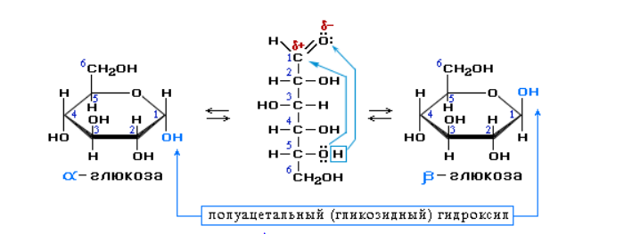
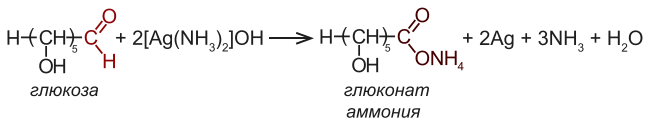
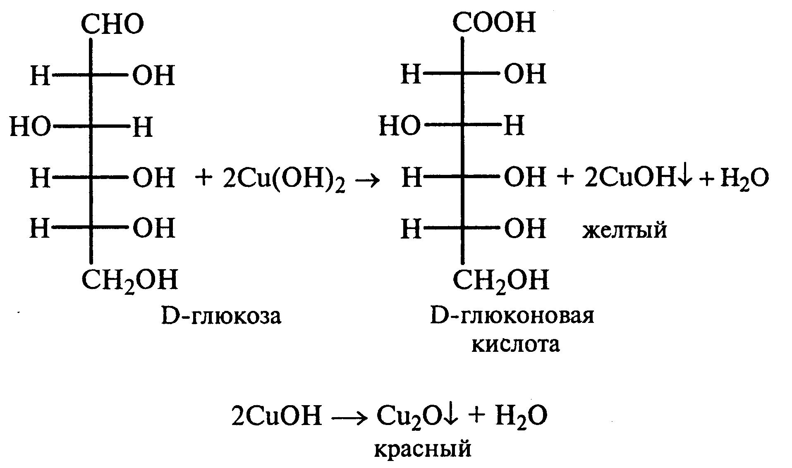
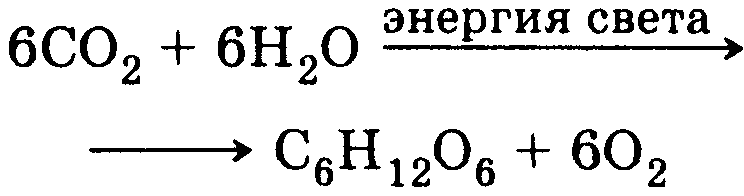
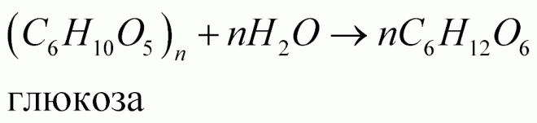

# Глюкоза
***
К углеводам относят многоатомные альдегидл- или кетоноспирты и некоторые производные. 
Классификация углеводородов:
1. По числу остатков простейших углеводов в молекуле: моносахариды(глюкоза, фруктоза, рибоза), олигосахариды(сахароза, мальтоза), полисахариды(крахмал, целлюлоза).
2. По функциональной группе: альдозы(содержат только альдегидную группу), кетозы(кетонная группа). 
3. По способности реагировать с реактивом Толленса или с Фелинговой жидкостью: восстанавливающие сахара(глюкоза) и невосстанавливающие(сахароза).
4. Другие признаки: сахароподобные(сахароза), несахараподобные(крахмал); пентозы и гексозы.
***
> Глюкоза C6H12O6 - органическое соединение, моносахарид (шестиатомный гидроксиальдегид, гексоза), один из самых распространённых источников энергии в живых организмах на планете. Встречается в соке многих фруктов и ягод, в том числе и винограда, от чего и произошло название этого вида сахара. Глюкозное звено входит в состав полисахаридов (целлюлоза, крахмал, гликоген) и ряда дисахаридов (мальтозы, лактозы и сахарозы), которые, например, в пищеварительном тракте быстро расщепляются на глюкозу и фруктозу.

### 1. Строение
Глюкоза принадлежит к классу альдогексоз, то есть является полигидроксиальдегидом, содержащим шесть атомов углерода, альдегидную группу и пять гидроксильных групп. Четыре атома углерода в её структуре являются хиральными, поэтому существует 16 стереоизомерных альдогексоз: некоторые встречаются в природе, некоторые получены синтетически.

Наряду с наиболее распространённым в природе моносахаридом D-глюкозой существует также её энантиомер L-глюкоза,который в природе практически не встречается
 
Часто D-глюкозу изображают в линейной форме, однако в действительности D-глюкоза существует в циклической форме, образованной в результате присоединения ОН-группы при углероде С-5 к альдегидной группе. Образующийся при этом циклический полуацеталь устойчив: в растворах и кристаллической форме D-глюкоза более чем на 99 % находится в форме полуацеталя.

При описанной циклизации возникает новый стереоцентр при полуацетальном атоме углерода, поэтому D-глюкопираноза может существовать в виде двух диастереомеров, называемых аномерами: α-D-глюкопиранозы и β-D-глюкопиранозы

### 2. Физические свойства
Глюкоза — бесцветное кристаллическое вещество без запаха. Обладает сладким вкусом. D-глюкоза представлена в виде трёх кристаллических форм: безводной α-D-глюкопиранозы, моногидрата α-D-глюкопиранозы и безводной β-D-глюкопиранозы

### 3. Химические свойства
##### 1. Свойства глюкозы как многоатомного спирта
- Взаимодействие с реактивом Фелинга

- Образование сложных эфиров при взаимодействии с кислотами, ангидридами, галогенангидридами

- Метилирование гликозидного гидроксила метиловым спиртом в присутствии сухой соляной кислоты
  C6H7O(OH)4OH+CH3OH=C6H7O(OH)4OCH3+H2O
##### 2. Свойства глюкозы как альдегида
- Восстановление до сорбита(глюцита)
C6H7O(OH)4OH+H2=C6H7OH(CHOH)4CH2OH
- Окисление аммиачным расствором оксида серебра. Образование аммонийной соли глюконовой кислоты
  Сопровождается частичной деструкцией углеродной цепи. Окисление проходит нестехиометрично.

- Окисление глюкозы гидроксидом меди при нагревании

##### 3. Реакции брожения глюкозы
- Спиртовое брожение до этанола
- Молочнокислое брожжение до молочной кислоты (CH3CHOHCOOH)
- Маслянокислое брожжение 
C6H12O6 → CH3CH2CH2COOH + 2CO2↑ + 2H2
- Лимоннокислое брожение (до лимонной кислоты)
2C6H12O6 + 3O2 → 2C6H8O7 + 4H2O

### 4. Получение 
В свободном виде глюкоза находится во многих растениях. 
В организме животных в мышцах, крови и является основным источником энергиии. 
В природе образуется в результате фотосинтеза растений

В промышленности гидролизом крахмала или целлюлозы

### 5. Применение
- В медицине: 
     - легкоусваемое вещество, дающее большое количество энергии(растворы 5-40% при отеке легких, сердечной недостаточности)
     - маннит - продукт восстановления маннозы(одного из изомеров глюкоз)-эффективное диуретическое средство(особенно при отеке головного мозга)
 - В кондитерской промышленности для выпечки хлеба, производство мороженого и сгущенного молока
 - В сельском хозяйстве для подкормки пчел