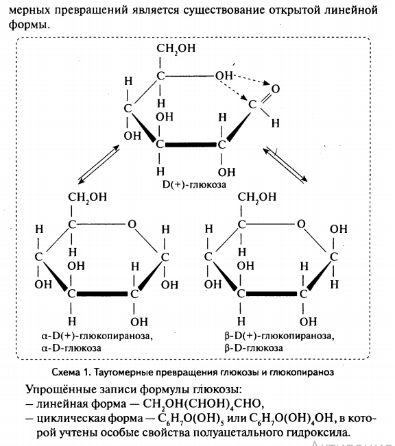

# Глюкоза
***
К углеводам относят многоатомные альдегидл- или кетоноспирты и некоторые производные. 
Классификация углеводородов:
1. По числу остатков простейших углеводов в молекуле: моносахариды(глюкоза, фруктоза, рибоза), олигосахариды(сахароза, мальтоза), полисахариды(крахмал, целлюлоза).
2. По функциональной группе: альдозы(содержат только альдегидную группу), кетозы(кетонная группа). 
3. По способности реагировать с реактивом Толленса или с Фелинговой жидкостью: восстанавливающие сахара(глюкоза) и невосстанавливающие(сахароза).
4. Другие признаки: сахароподобные(сахароза), несахараподобные(крахмал); пентозы и гексозы.
***
> Глюкоза C6H12O6 - органическое соединение, моносахарид (шестиатомный гидроксиальдегид, гексоза), один из самых распространённых источников энергии в живых организмах на планете. Встречается в соке многих фруктов и ягод, в том числе и винограда, от чего и произошло название этого вида сахара. Глюкозное звено входит в состав полисахаридов (целлюлоза, крахмал, гликоген) и ряда дисахаридов (мальтозы, лактозы и сахарозы), которые, например, в пищеварительном тракте быстро расщепляются на глюкозу и фруктозу.

### 1. Строение
Глюкоза принадлежит к классу альдогексоз, то есть является полигидроксиальдегидом, содержащим шесть атомов углерода, альдегидную группу и пять гидроксильных групп. Четыре атома углерода в её структуре являются хиральными, поэтому существует 16 стереоизомерных альдогексоз: некоторые встречаются в природе, некоторые получены синтетически.

Наряду с наиболее распространённым в природе моносахаридом D-глюкозой существует также её энантиомер L-глюкоза,который в природе практически не встречается

### 2. Физические свойства
Глюкоза — бесцветное кристаллическое вещество без запаха. Обладает сладким вкусом. D-глюкоза представлена в виде трёх кристаллических форм: безводной α-D-глюкопиранозы, моногидрата α-D-глюкопиранозы и безводной β-D-глюкопиранозы

### 3. Химические свойства
##### 1. Свойства глюкозы как многоатомного спирта
- Взаимодействие с реактивом Фелинга

- Образование сложных эфиров при взаимодействии с кислотами, ангидридами, галогенангидридами

- Метилирование гликозидного гидроксила метиловым спиртом в присутствии сухой солянки
 ля тут должна быть пикча но мне лень