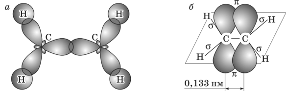
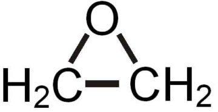

АЛКЕНЫ
======

> **Алкены** относятся к ненасыщенным углеводородам. Ненасыщенными называют вещества, содержащие кратные связи. Формула алкенов CnH2n

### 1. Нахождение в природе

В природе ациклические алкены практически не встречаются, Простейший представитель этого класса органических соединений — этилен (C2H4) — является гормоном для растений и в незначительном количестве в них синтезируется.

### 2. Строение

-   SP2-гибридизация
-   сигма связи находятся в одной плоскости под углом в 120 градусов
-   Длина связи 0,134 нм
-   Негибридизованные пи орбитали образуют пи связь
-   Пи связь расположена перпендикулярно плоскости и является плоскостью симметрии молекулы

### 3. Изомерия

-   Поэтому для алкенов характерна геометрическая изомерия: цис-, транс-
-   Так же имеется изомерия углеродной цепи молекулы
-   Положения кратной связи
-   Межклассовая с циклоалканами

### 4. Физические свойства

> Температуры плавления и кипения алкенов увеличиваются с молекулярной массой и длиной главной углеродной цепи.
>
> Похожи на физические свойства алканов: с 2-4 - газы, 5-17 - жидкости, далее твердые, все легче воды и нерастворимы в ней, пары в смеси с воздухом взрывоопасны.

Свойства отдельных представителей:

> • Этилен — вызывает наркоз, обладает раздражающим и мутагенным действием.
> • Пропилен — вызывает наркоз (сильнее, чем этилен), оказывает общетоксическое и мутагенное действие.
> • Бутен-2 — вызывает наркоз, обладает раздражающим действием\[9\].

### 5. Химические свойства

В химических реакциях пи связь слабее сигма и легко разрывается, поэтому для алкенов характерно больше реакции, чем для алканов. Например реакция присоединения. Она проходит по правилу Морковникова, котрое гласит:

> **Правило Марковникова** - атом водорода присоединяется преимущественно к тому атому углерода, образующих кратную связь, который имеет больше атомов водорода. Атом галогена или гидроксо- группа присоединяется к другому углероду при кратной связи.
> Так же для алкенов характерны реакции окисления, полимеризации.

Качественными реакциями на кратную связь являются: обесцвечивание раствора брома или йода и раствора перманганата калия.

-   Реакции присоединения
    -   Гидрирование с катализатором
    -   Присоединение галогенов
    -   Гидратация

    Механизм реакции - электрофильное присоединение, по правилу Марковникова
    (элек. Присоединение соблюдается только для электродонорных заместителей, не для электроноакцепторных. См еще)
    -   Присоединение галогеноводородов (нарушение правила Марковникова в присутствии перекиси водорода)

-   Реакции окисления
    -   Горение в кислороде
    -   Взаимодействие с растворами окислителей (с 368)
    -   Каталитическое окисление
        а) получение окиси этилена 150-300, Ag
        
        б) получение уксусного альдегида PdCl2
-   Реакции полимеризации
    *-CH2=CH-CH3 -- (-C2-CH(CH3)-*

### 6. Получение

-   Дегидрирование алканов
-   Дегалогенирование
-   Межмолекулярная дегидратация спиртов больше140 H+(по правилу Зайцева)

    > **Правило Зайцева** - при отщеплении воды и галогеноводородов наиболее легко отщепляется водород от соседнего наименее гидрогенезированного атома углерода.

-   Дегидрогалогенирование NaOH EtOH
-   Неполное гидрирование алкинов

### 7. Применение

Вещества для органического синтеза(полимеры, фенол, ацетон, растворители), улучшение детонационных свойств топлива, этилен - ускорение созревания плодов растений
