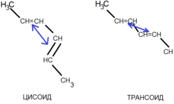

# АЛКАДИЕНЫ
> Алкадиенами называют углеводороды, в молекулах которых содержатся две двойные связи
> 
Различают три типа алкадиенов:
- С изолированными связями (пентадиен-1,4)
- С сопряженными связями (бутадиен-1,3)
- С кумулированными связями (бутадиен-1,2)
### 1. Строение
Каждый тип имеет свои свойства и образуют различные гомологичные ряды. 
	Сопряженные имеют особые свойства: электроны пи связи более подвижны, они образуют единую пи систему. 
- sp2 гибридизация 
- Молекула плоская 120
- Система сопряженных связей
- Длина связи 2,3 - 0,145(меньше алканов), 1,2 и 3,4 - 0,137(чуть больше этилена)
	
Сопряженные диены существуют в виде двух конформаций — цисоидной (s-цис-форма) и трансоидной (s-транс-форма), способных переходить друг в друга, более устойчивой является s-транс-форма:
    
	
	
### 2. Изомерия
- Углеродной цепи молекулы
- Положения кратной связи
- Межклассовая(алкины)
	
### 3. Физические свойства
Бутадиен - газ, изопрен - жидкость
	
### 4. Химические свойства
Пи связь в алкадиенах легко разрывается. 
	Присоединение происходит преимущественно в 1,4-положения
	
- Присоединение по кратной связи
	 Происходит в две стадии: сначала в 1,4-положение, связь перестраивается. При избытке реагента присоединение в 2,3-положение.
  - Гидрирование
  - Галогенирование
  - Гидрогалогенирование 
	
	Типы: 
	- 1,4-присоединение: атомы реагента оказываются у крайних углеродов, двойная связь перемещается температура 60-80
	- 1,2-присоединение (правило Марковникова) температура -40-20 
	
	Почему так происходит? Механизм электрофильного присоединения.
	   1. Электрофильная атака протона: H к 1 углероду, образуется карбокатион, в котором у оставшихся трех углеродов недостает электронной плотности, оставшаяся двойная связь делокализуется между ними.  - это резонансный гибрид  
	 При локализации двойной связи между 2,3 заряд у 4(карбокатион 1), между 3,4 заряд у 2(карбокатион 2).
	   2. Присоединение аниона к карбокатиону 1 это 1,4 присоединение. Если к карбокатиону 2 - это 1,2 присоединение.
	
  Не вступают в реакцию гидратации, т.к. начинается полимеризация.
	 
- Реакции окисления
	 - Горение
	 - Взаимодействие с растворами окислителей 
	
- Полимеризация
	Диены легко полимеризуются. В природе существует большое число соединений, образовавшихся в результате полимеризации диенов.  Наиболее простое из них - натуральный каучук. Получают из изопрена (CH2=C(CH3)-CH=CH2)
	Имеется геометрическая изомерия. В природном каучуке все звенья в цис-конфигурации. 
	
	Дивиниловый каучук-стереорегуляторный синтетический каучук: каучук из бутадиена, только 1,4 присоединение, цис-конфигурация.
	
	Прочие каучуки: бутадиенстирольный, хлоропреновый. 
### 5. Получение
- Синтез Лебедева из этанола бутадиен 425, Al2O3, ZnO
- Дегидрирование бутана 
  1. стадия 560-620 Al2P3, Cr2O3
  2. стадия 560-600 MgO, ZnO
  3. изопрен - дегидрированием 2-метилбутана
  4. хлорпрен - присоединение хлороводородных к винилацетилену
	
### 6. Применение:
- Присоединением серы к каучуку получают резину-вулканизация
- Производство автомобильных шин
- Медицинские изделия: грелки, перчатки
