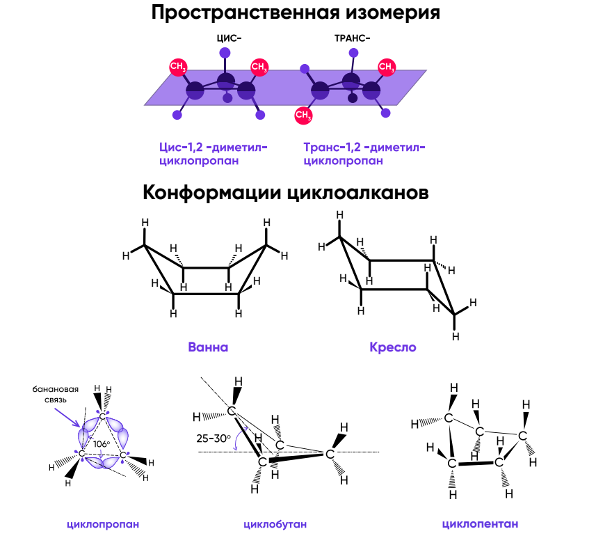

# ЦИКЛОАЛКАНЫ(Нафтены)

> Циклоалканами называются углеводороды, в молекулах которых все атомы углерода соединены одинарными связями и несколько атомов углерода образуют замкнутый цикл, а остальные валентности насыщены атомами водорода.
	
### 1. Строение
- sp3 гибридизация
- углы циклопропана и циклобутана 60,90

***

По теории Байера любое отклонение связей от предопределенного угла вызывает напряжение в молекуле, т.е. повышенную энергию. Из-за этого данные соединение неустойчивы.
	
***

Циклопропан имеет "банановые связи".  В отличие от обычной сигма связи, где максимум электронной плотности на межъядерной линии, связи между атомами углерода перекрываются с отклонением от межъядерной линии, т.е. имеют частичный пи характер. 
	
### 2. Изомерия
• Изомерия углеродного скелета;
• Межклассовая изомерия с алкенами.
• Пространственная
а) Геометрическая
б) Оптическая

	
### 3. Физические свойства
- 3-4 - газы, 5-12 - жидкости. 
- Все нерастворимы в воде, Пары взрывоопасны. 
	
### 4. Химические свойства
- Реакции присоединения к малым циклам с разрывом цикла
	 - Галогенирование
	 - Галогеноводороды в водных растворах
	 - Гидрирование
	
- Реакции больших циклов
	 - Гидрирование(УФ)
	 - Дегидрирование
	 - Окисление
		Циклогегксан до циклогексанола, затем до кетона.
		
При воздействии азотной кислотой на циклогексан при нагревании и повышенном давлении связь между углеродами разрывается , образуется адипиновая кислота.
	
	
### 5. Получение
- Выделение из нефти
- Действием активных металлов на дигалогеналканы
	
### 6. Применение
- В процессе реформинга , перегонка нефти-бензол, толуол
- Органический синтез 
