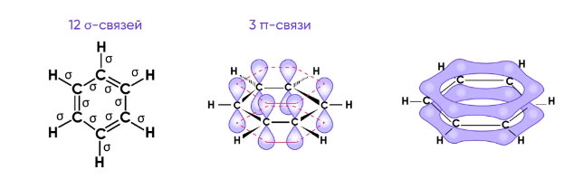
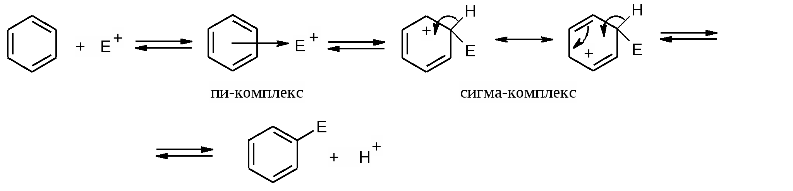
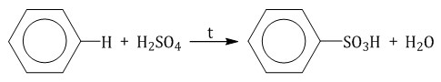
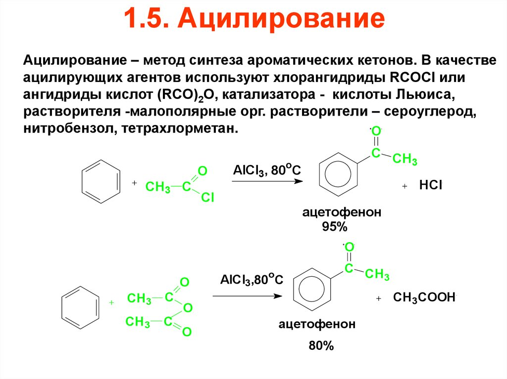

# АРЕНЫ

> Аренами называют углеводороды, в молекулах которых содержится одно или несколько бензольных колец. 
	• Общая формула CnH2n-6
	
### 1. Строение (на примере бензола)
- атомы углерода в состоянии sp~2~ гибридизации
- атомы углерода соединены друг с другом и с атомами водорода сигма связями 
- молекула бензола плоская, углы 120
- шесть негибридизованных пи орбиталей образуют единую сопряженную пи систему, электронная плотность которой расположена над и под плоскостью сигма скелета - ароматическая система
- длина связи 0,139 нм
	
    ***

	_Критерии ароматичности:_
- Наличие плоского цикла с замкнутой системой сопряжения
- Число электронов, принимающих участие в сопряжении, равно 4n+2 (Правило Хюккеля)
	
### 2. Физические свойства
Бензол - бесцветная жидкость с характерным запахом, нерастворим в воде, ядовит.
	Орто-изомеры кипят при более высокой температуре, чем пара-изомеры.
	
### 3. Химические свойства

Электрофильное замещение в бензольном кольце 
- Замещение атома водорода в кольце (катализаторы!)
	
    - Галогенирование (FeCl~3~, AlCl~3~)
	
	Под действием катализатора связь в молекуле Br~2~ разрывается гетеролитически: эл пара, связывающая атомы брома, образует новую связь Fe-Br по донорно-акцепторному механизму. В результате образуется комплексный ион - тетрабромоферрат III - ион и бромоний-катион.
	Сначала бромоний-катион электростатически притягивается пи системой бензола, при этом образуется пи комплекс, соединение без локализованной ковалентной связи. 
	
    
	За счет флуктуации(см еще) электронной плотности у атомов углеродакольца, вызванной ассимметрическим распределением электронов вокруг ядер(дисперсионное взаимодействие) и внедрение чужеродного атома(индукционное взаимодействие). Так у одного из атомов возникает избыток электронной плотности. Происходит локализация атома брома. Пи электроны выводятся из системы и создается связь между углеродом и бромом. Образующийся продукт - сигма комплекс. 
	Данный комплекс не является ароматическим.
	
 

	На следующей стадии происходит восстановление ароматичности:
	1. связь Fe-Br в тетрабромоферрат-ионе разрывается гетеролитически. Общая эл пара уходит с атомом брома, восстанавливая катализптор.
	2. эл пара бромид иона используется для образования связи между H-Br
	3. связь C-H разрывается гетеролитически. Общая эл пара уходит с атомом углерода, восстанавливая сопряженную систему
	
    ***
	 - Нитрирование с серной
Азотная кислота по отношению к серной ведет себя как основание. Врезультате образуется нитроний-катион - электрофил, атакующий кольцо. В этом случае промежуточного соединения нет, а гидроксил-ион вместе с протоном из серной образуют воду, серная восстанавливается водородом из кольца.
	
	- Сульфирование концентрированной
	

	
- Алкилирование (Фридель-Крафтс) AlCl~3~
	Механизм такой же как при галогенировании. Общее: 
	Образование электрофила под действием катализатора - образование пи комплекса, затем сигма комплекса с нарушением ароматичности - восстановление ароматичности за счет отщепления протона и регенерации катализатора. 
***
	Существует два типа заместителей
	1. Заместители первого порядка(-CH~3~, -C~2~H~5~, -OH, -NH~2~, -Cl)
	Имеют не поделённые эл пары, вступающие во взаимодействие с ароматической системой, увеличивают электронную плотность на  атомах, находящихся в орто- и пара- положениях.
	2. Заместители второго порядка(-NO~2~, -COOH, -CN)
	Уменьшают эл плотность в пи системе в целом и в меньшей степени на атомах в мета-положении. 
	
	- Ацилирование
	

- Реакции окисления
	- Горение
	 - Бензол с перманганатом калия не реагирует, гомологи до ароматической кислоты
	
- Реакции присоединения
  Протекает с трудом
	- гидрирование 350 Pt
	 - Хлорирование при облучении в гексахлоран
  > Гексахлоран - обладает инсектицидным действием, поэтому раньше его применяли в сельхозе для протравливания семян и борьбы с вредителями,нейротоксичным действием, поэтому его применение ограничено. 
	
- Реакции по радикалу
  Стирол проявляет общие свойства алкенов: присоединения, окисление, полимеризации и окисления
	
### 4. Получение
- Выделение из продуктов коксового угля и переработки нефти
- Ароматизация алканов и циклоалканов 300
- Тримеризация ацетилена и его гомологов
- Сплавление солей бензойной кислоты с гидроксидом натрия
	
	Получение производных бензола:
- Реакция Вюрца-Фиттига
 - Алкилирование аренов Реакция Фриделя-Крафтса
	
### 5. Применение
	Бензол и его гомологи используются для получения красителей, лекарственных средств, взрывчатых веществ, ядохимикатов, пластмасс и синтетических волокон, повышение октанового числа в бензине.
	Бензольные кольца содержатся в строении многих биологически активных веществ: гормоны, аминокислоты, белки.
