# Альдегиды + кетоны
> **Оксосоединения** - органические вещества, в молекулах которых имеется карбонильная, или оксо-, группа
**Альдегидами** называются органические вещества, молекулы которых содержат карбониьную группу, соединенную с атомами водорода и углеводородным радикалом. 
	Общая формула CnH2n+1CHO
**Кетонами** называются органические вещества, молекулы которых содержат карбонильную группу, соединенную с двумя углеводородными радикалами.
	Общая формула CnH2nO
	
# АЛЬДЕГИДЫ
### 1. Строение
1. Атом углерода находится в состоянии sp2 гибридизации
2. Сигма связи находятся в одной плоскости
3. Углы примерно 120 
4. Длина связи углерод-кислород=0,122 нм
5. Негибридизованные пи орбитали атомов углерода и кислорода образуют пи связь, которая расположена перпендикулярно плоскости, образованной сигма связями
6. Связь С=О сильно поляризована, и на атоме углерода имеется частичный положительный заряд. 

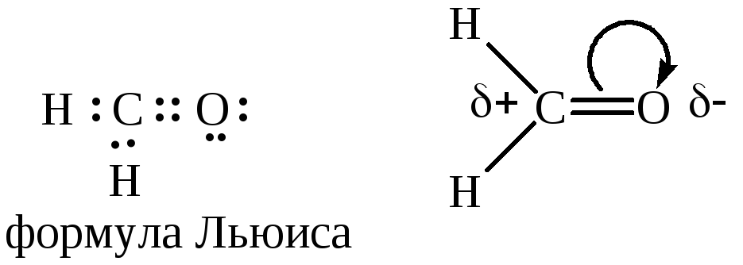

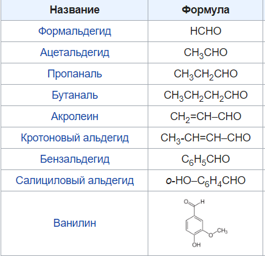

### 2. Изомерия 
	1. Углеродной цепи молекулы
	2. Изомерия альдегидов и кетонов начиная с 3
	3. Положение оксогруппы в кетонах начиная с 5
		
### 3. Физические свойства 
- В альдегидах водородные связи более слабые, чем в спиртах. 
	Поэтому из всех альдегидов с одной карбонильной группой только формальдегид представляет собой газообразное при комнатной температуре вещество. Альдегиды С2 - С12 — жидкости, а альдегиды нормального строения с более длинным неразветвлённым углеродным скелетом, являются твёрдыми веществами. Температуры кипения альдегидов с неразветвлённым строением углеродной цепи выше, чем у их изомеров. Они кипят при более низких температурах, чем спирты с тем же числом углеродных атомов
- Низшие альдегиды имеют резкий запах, 4-6 - неприятный запах, высшие - цветочным запахом
- Метаналь хорошо растворим в воде
	
### 4. Химические свойства
- Присоединение по кратной связи С=О
   - Восстановление водородом 
   - Реакции нуклеофильного присоединения 
     - Синильная кислота CNH

      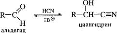	
				
     - Гидросульфит натрия 

      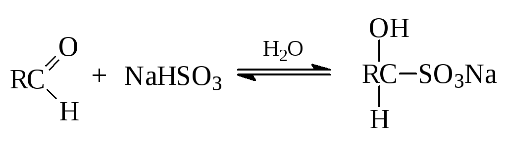

				
     - Присоединение спиртов (образование полуацеталей и ацеталей)
				
     - Присоединение воды к метаналю с образованием гидрататной формы метаналя . 
Гидраты альдегидов могут существовать только в водных растворах. 
				
      - Присоединение аммиака и NH2-содержащих веществ-промежуточный продукт присоединения неустойчив и стабилизируется, отщепляя молекулу воды

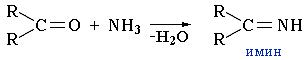	
   - С реактивом гриньяра

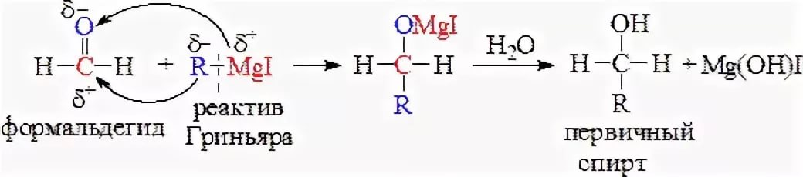	
				
				
- Реакции окисления 
      - Горение в кислороде 
      - С  окислителями 
        - Аммиачный раствор оксида серебра (Реактив Толленса)
        - С гидроксидом меди при нагревании

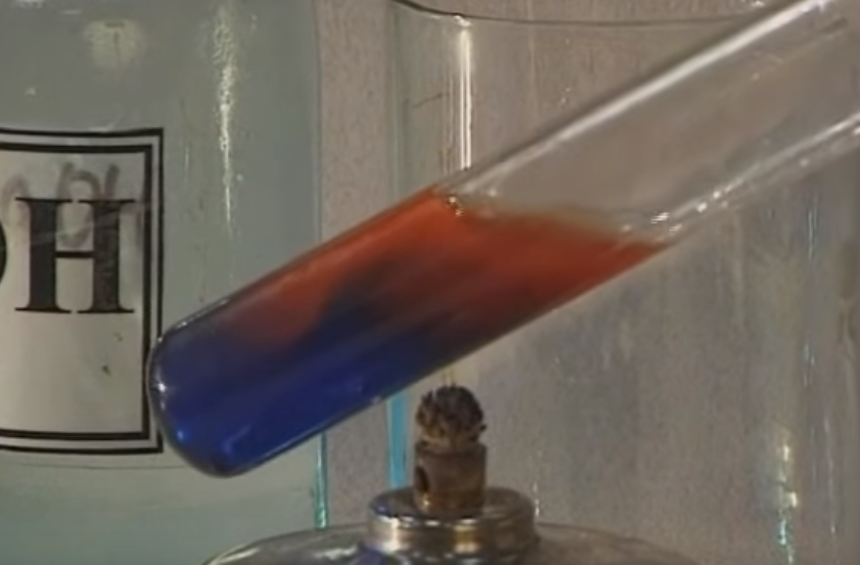

				
				
- Реакции замещения
       - Замещение карбонильного кислорода при взаимодействии с PCl5, NH3, NH2OH и т.д.
			Образование дигалогеналкана 
   - Реакции по углеводородному радикалу альфа углерод 
			
	- Реакции полимеризации и поликонденсации 
      - Полимеризация сухого формальдегида в присутствии специфических катализаторов

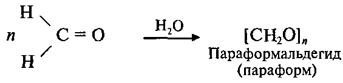
			
   - Тримеризация ацетальдегида 

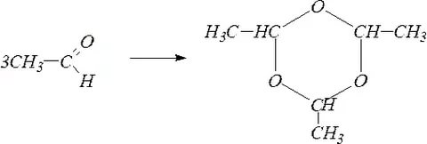

   - Реакция поликонденсации формальдегида с фенолом с образованием фенолформальдегидной смолы

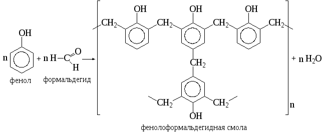
			
### 5. Получение
- Окисление первичных спиртов оксидом меди
			
- Каталитическое дегидрирование первичных спиртов
			
- Щелочной гидролиз дигалогенпроизводных
			
- Гидратация алкинов по Кучерову 
			
- Получение формальдегида 
   - Каталитическое окисление метанола Cu, t
   - Каталитическое окисление метана 500
				
- Получение ацетальдегида каталитическим окислением этилена PdCl2
			
   - пиролиз кальциевых и бариевых солей карбоновых кислот  
			
   - восстановительный озонолиз симметричных дизамещённых алкенов либо циклических алкенов (в данном случае реакция приводит к образованию диальдегида). Аналогичное превращение может быть проведено под действием смеси OsO4 и NaIO4

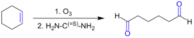
			
- Важным методом также является гидроборирование — окисление алкинов, в ходе которого к алкину против правила Марковникова присоединяется диалкилборан (например, дисиамилборан), а полученный продукт окисляется щелочным раствором пероксида водорода, что приводит к образованию альдегида

### 6. Применение 
- Полиформальдегид используется для изготовления волокон
- В медицине
- Консервирование биологических препаратов 
- Протравливание семян 
- Получение уксусной кислоты
- Выделка кож формальдегидом 
- Ацетальдегид содержится в составе табачного дыма
- В парфюмерии 
- Пищевая промышленность - бензальдегид - горький миндаль
- Апельсин - пеларгоновый альдегид

# КЕТОНЫ
### 1. Строение 
1. Атом углерода находится в состоянии sp2 гибридизации
2. Сигма связи находятся в одной плоскости
3. Углы примерно 120 
4. Длина связи углерод-кислород=0,122 нм
5. Негибридизованные пи орбитали атомов углерода и кислорода образуют пи связь, которая расположена перпендикулярно плоскости, образованной сигма связями
6. Связь С=О сильно поляризована, и на атоме углерода имеется частично положит заряд

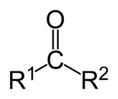

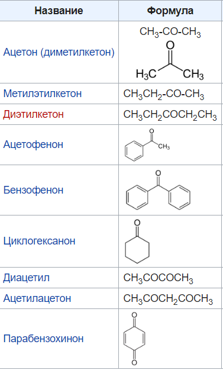

### 2. Изомерия 
1. Углеродной цепи молекулы
2. Изомерия альдегидов и кетонов начиная с 3
3. Положение оксогруппы в кетонах начиная с 5
4. Таутомерия-тип изомерии, при которой происходит быстрое самопроизвольное обратимое взаимопревращение структурных изомеров - таутомеров. Процесс взаимопревращения таутомеров называется таутомеризацией
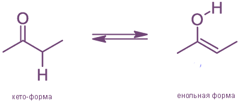
*** 	
		
Для оксосоединений, имеющих атом водорода в α-положении по отношннию к карбонильной группе, существует равновесие между таутомерными формами. Для подавляющего большинства оксосоединений это равновесие смещено в сторону кето-формы. Процесс перехода кето-формы в енольную называют енолизацией . На этом основана способность таких кетонов реагировать как С-или О-нуклеофилы. Концентрация енольной формы зависит от строения кетонов и составляет (в %): 0,0025 (ацетон), 2 (циклогексанон), 80 (ацетилацетон). Скорость енолизации возрастает в присутствии кислот и оснований.

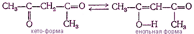

*** 	
		
		
### 3. Физические свойства
Кетоны — летучие жидкости или легкоплавкие твёрдые вещества, низшие представители хорошо растворимы в воде и смешиваются с органическими растворителями, некоторые (ацетон) смешиваются с водой в любых соотношениях. Невозможность образования межмолекулярных водородных связей обуславливает несколько бо́льшую их летучесть, чем у спиртов и карбоновых кислот с той же молекулярной массой

### 4. Химические свойства
- Присоединения 
   - Гидрирование
			
   - Гидратация с образованием гидратов
			
   - С синильной кислотой

   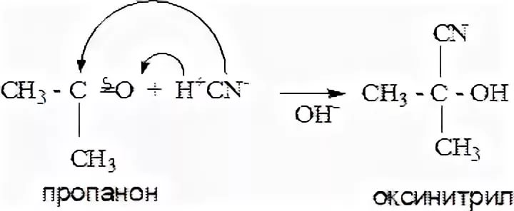

   - С гидросульфитом натрия

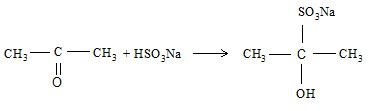
			
   - С реактивом Гриньяра
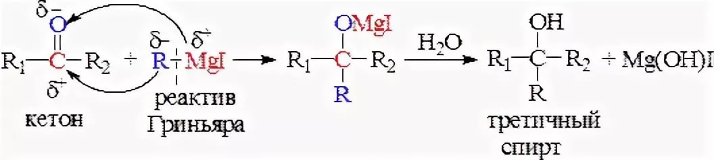

   - С гидроксиламином кетоны образуют кетоксимы,выделяя воду

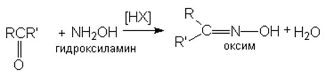
			
- Замещение по альфау-глероду
   - С галогенами 
			
- Окисление 
   - С сильными окислителями с трудом с разрывом углеродных связей и образованием смеси кислот
   - Практическое значение имеет реакция окисления циклогексанона в адипиновую кислоту:

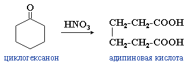
      
В этом случае продуктом окисления является одно соединение, так как разрыв соседних с карбонильной группой связей приводит к одному результату.
			
### 5. Получение 

1. Окисление вторичных спиртов оксидом меди
2. Каталитическое дегидрирование вторичных спиртов 
3. Щелочной гидролиз дигалогенпроизводных
4. Гидратация гомологов ацетилена по Кучерову
### 6. Применение
В промышленности кетоны используют как растворители, фармацевтические препараты и для изготовления различных полимеров.
