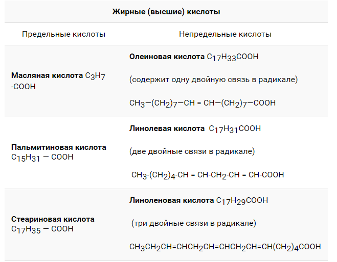

# Жиры

>Жиры - сложные эфиры, образованные глицерином и высшими одноосновными карбоновыми кислотами (жирными кислотами). 

### 1. Строение.
В состав жиров входят остатки глицерина и алкильные радикалы (остатки) высших карбоновых кислот.

### 2. Изомерия.
Т.к жиры - сложные эфиры, то для них характерны следующие виды изомерии:
1. Изомерия углеродной цепи начинается по кислотному остатку с бутановой кислоты, по спиртовому остатку — с пропилового спирта: этилбутират и этилизобутират, пропилацетат и изопропилацетат.
2. Изомерия положения сложноэфирной группировки —СО—О—. Этот вид изомерии начинается со сложных эфиров, в молекулах которых содержится не менее 4 атомов углерода: этилацетат и метилпропионат.
3. Межклассовая изомерия: метилацетат и пропановая кислота.
### 3. Физические свойства.
1. Нерастворимы в воде, растворяются в органических растворителях.
2. Растительные(масла) при комнатной температуре находятся в жидком агрегатном состоянии. Исключение: пальмовое масло твёрдый жир.
Животные жиры при комнатной температуре в твёрдые тела. Исключение: рыбий жир жидкий. Твёрдые жиры не имеют кристаллического строения и представляют собой мазеподобные субстанции.
3. Точная tпл у жиров отсутствует. Определённой tпл обладают лишь некоторые триглицериды.
в твердых жирах преобладают триглицериды с остатками насыщенных кислот, имеющие относительно высокие температуры плавления.
для жидких жиров (масел), напротив, характерно высокое содержание триглицеридов ненасыщенных кислот с низкими температурами плавления.
4. Точная tкип жиров отсутствует. 
5. Масла являются прозрачными, вязкими жидкостями. Окраска у жиров зависит от сопутствующих веществ, чаще всего они белые или желтоватые.
6. Запах отсутствует или слабый, специфический.
### 4. Химические свойства
1. Гидролиз жиров.
- Кислый гидролиз. Продукты: карбоновая к-та и глицерин
- Щелочной (омыление) гидролиз. Продукты: соли карбоновой к-ты (мыла) и глицерин реакция Шевреля
2. Электрофильное присоединение (остатки непредельных карб. к-т)
 - Гидрирование остатков ненасыщенных кислот
- Галогенирование остатков ненасыщенных кислот
- Гидрогалагенирование остатков ненасыщенных кислот
3. Окисление
-Горение
-прогоркание:
а) неферментативное — кислород присоединяется по месту двойных связей, образуя пероксиды; при разложении пероксидов жирных кислот получаются альдегиды.
б) ферментативное с участием липоксидаз и липоксигеназ, образуются гидропероксиды.
в) ферментативное (кетонное) — происходит при участии микроорганизмов.

4. Полимеризация
На воздухе они окисляются и полимеризуются
###  5. Получение
Жиры получают реакцией этерификации — взаимодействие  глицерина с высшими карбоновыми кислотами (реакция Бертло)

### 6. Применение
- Жидкие жиры взаимодействуя с кислородом воздуха, способны образовывать твердые пленки – «сшитые полимеры». Такие масла называют «высыхающими». Они служат основой для натуральной олифы и красок.
- Животные жиры могут долго храниться на воздухе, не меняя своей консистенции, и потому называются «невысыхающими».
- Пищевая промышленность
- Фармакология
- Медицина
- Химическая мб (краски на масляной основе там)