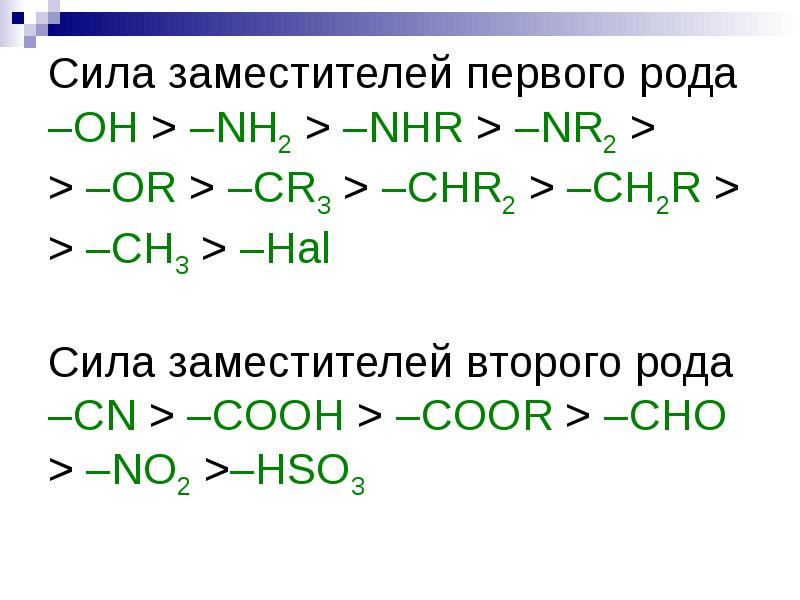

# ТОЛУОЛ
### 1. Строение
Т.к. алкильные заместители повышают эл плотность на атоме углерода с sp2 гибридидными орбиталями(+I эффект), то присоединение к 2,4,6 положениям идет намного легче. 
### 2. Взаимное влияние атомов в молекуле
>**Индуктивный эффект** – смещение электронной плотности по цепи σ-связей, которое обусловлено различиями в электроотрицательностях атомов
***	
Индуктивный эффект называется **положительным (+I)**, если заместитель увеличивает электронную плотность на атоме углерода, индуцируя на нем частичный отрицательный заряд δ-, сам при этом приобретая заряд δ+, т.к. заместитель имеет неподеленную эл пару.
***
>Индуктивный эффект называют **отрицательным (–I)**, если заместитель уменьшает электронную плотность на атоме углерода, с которым связан этот заместитель. При этом заместитель приобретает частичный отрицательный заряд (δ-), а атом углерода – частичный положительный заряд (δ+).

Индукционный положительный эффект характерен для метильного радикала.

Для гидроксо и амино группы характерен отрицательный индукционный эфффект. 
Активирование бензольного кольца под действием этих групп обусловлено мезомерным эффектом. 
> **Мезомерный эффект** – смещение электронной плотности по цепи делокализованных (сопряженных) π-связей.
> **+М**-эффектом обладают заместители, повышающие электронную плотность в сопряженной системе. К ним относятся группы, которые содержат атомы с неподеленной парой электронов, способные к передаче этой пары электронов в общую систему сопряжения.

Так неподеленная пара кислорода или азота вовлекается в пи систему и в итоге эл пара восьми электронов расположена между семью атомами. 
> **–М**-эффект проявляют заместители, содержащие электроотрицательные атомы и понижающие электронную плотность в сопряженной системе. Такими свойствами обладают группы: >C=O, –COOH, –COOR, –C≡N, –NO2, –SO3H и др.
> 
Так восьмиэлектронная плотность распределена между восьмью атомами, электроотрицательный атом оттягивает на себя эл пары, из-за чего эл плотность кольца "вымывается"

Для гидроксо и амино группы характерно преобладание +м эффекта над -I.

Для галоген-заместителей преобладает -I эффект над +М, следовательно, галогены направляют атаку в орто- и пара- положения, но дезактивируют бензольное кольцо, затрудняя реакции электрофильного замещения. 

### 3. Физические свойства
- Жидкость
- Нерастворим в воде
- Резкий характерный запах
- Плотность меньше чем у воды
- Обладает слабыми наркотическими свойствами
- Способен впитываться через кожу
- легко воспламеняется и горит коптящим пламенем

### 4. Химические свойства
- Реакции по кольцу
    - Галогенирование (FeBr~3~, FeCl~3~)
	 - Нитрование в серной
	 - Алкилирование (AlCl~3~)
	 - Гидрирование(электрофильное присоединение, ионный механизм)
	 - С раствором брома реакции нет
	
- Реакции по радикалу
	 - с Cl~2~ (УФ)
	 
- Реакции окисления
	 - Горение
	 - С сильными окислителями до кислоты
	    - В нейтральной среде до соли
	    - В щелочной так же до соли
### 5. Получение
- Из нефти
- Переработка каменного угля
- дегидратация циклогептана
- Алкилирование бензола 
- Дегидроциклизация гептана
- Реакция Фриделя Крафтса - бензол с метанолом (H3PO4\H2SO4\BF3)
- Реакция Вюрца-Фиттига из хлорбензола с хлором и натрием 
	
### 6. Применение
- Вторичное осветление бензина
- Растворитель
- Краски 
- Фармацевтические препараты
- Косметика-лаки, краска для волос
- синтез другой органики
- Моторное масло
