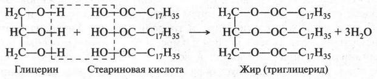
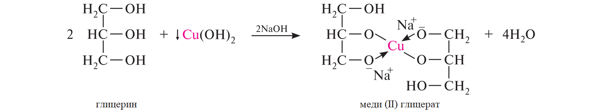
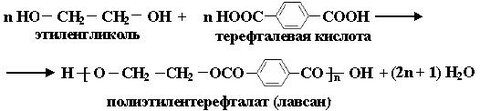
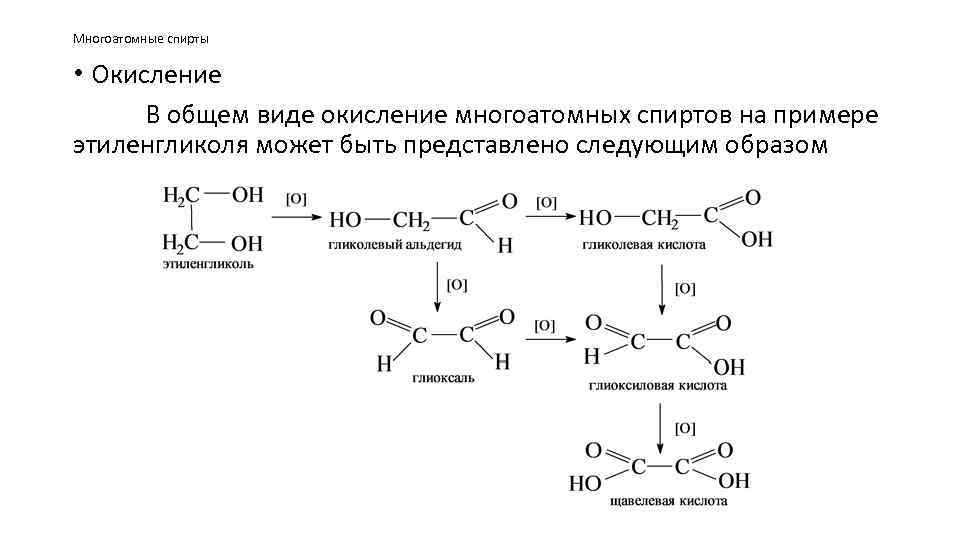
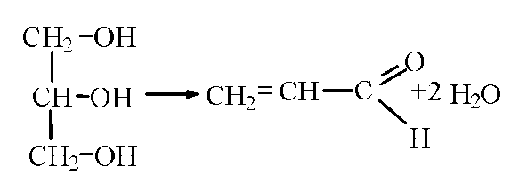
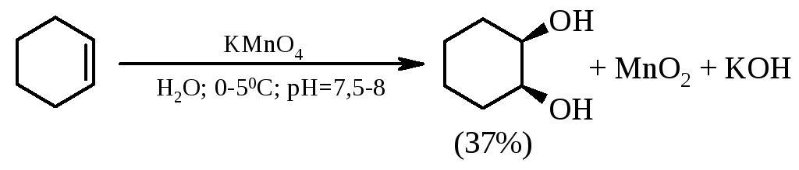
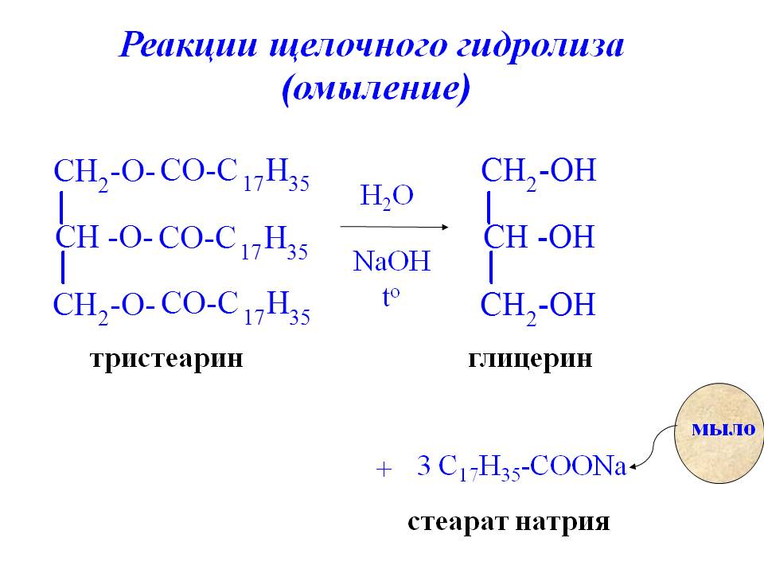
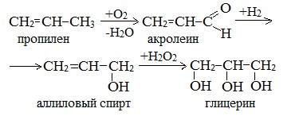

# Многоатомные спирты(на примере этиленгликоля)
> Многоатомные спирты - органические вещества, в молекулах которых содержится несколько гидроксильных групп, соединенных с углеводородным радикалом.
	
#####Классификация спиртов
1. По природе углеводородного радикала
		- Предельные
		- Непредельные
		- Ароматические
2. По числу гидроксильных групп
		- Одноатомные
		- Многоатомные
3. По положению гидроксильной группы
		- Первичные
		- Вторичные
		- Третичные
		
		Общая формула CnH2n+1OH 
		
#### Наиболее важные многоатомные спирты:
- Этиленгликоль (этандиол-1,2)
- Глицерин (пропантриол-1,2,3)

### 1. Строение
- атом углерода в sp3 гибридизации
- валентный угол 109,28
- Связи C-O и O-H полярны
- связи O-H и C-O разрываются более легко, чем связи H-C, C-C
- гидроксильная группа участвует в образовании водородных связей
- Группы oh взаимодействуют друг на друга, поэтому отщепление водорода идет легче - кислотные свойства усиливаются

### 2. Физические свойства 
- Этиленгликоль ядовит
- Этилен гликоль и глицерин - бесцветные, вязкие, сладкие на вкус жидкости, хорошо растворимые в воде.
### 3. Химические свойства
Химические свойства аналогичные одноатомным спиртам, но есть характерная особенность-растворение свежеполученного гидроксида меди. 

- Замещение водорода в гидроксо-группе
   - Активные металлы изб\нед
   - С растворами щелочей 
   - Этерификация 
			- Образование жиров при взаимодействии глицерина с высшими карбоновыми кислотами

			
   - Получение эфиров азотной кислоты
   - Взаимодействие с гидроксидом меди

		
		
		
   - Получение полиэфира лаванса(полиэтилентерефталата) реакцией поликонденсации

		
- Замещение группы OH
   - С кислотами 

- Реакции окисления
   - Горение в кислороде
   - При действии окислителей

		
- Реакции дегидратации
   - Глицерин в пропеаналь

		
	-  Дегидратация этиленгликоля 
			i.Внутремолкулярная - в этаналь
			ii. Межмолекулярная - в диэтиленгликоль

### 4. Получение
1. Гидролиз дигалогеналканов и полигалогеналканов водными растворами щелочей
2. Восстановление карбонильных соединений (кетон + водород)
3. Окисление этилена водным раствором перманганата калия или пероксида водорода - в этиленгликоль
4. Гидроксилирование по Вагнеру 

	
5. Получение глицерина
		1. Гидролиз жиров

	2. Из пропилена

### 5.Применение
- Этиленгликоль в приготовлении жидкостей для охлаждения двигателей в зимних условиях. Для получения полиэтилентерефталата, полиэтиленгликолей, растворитлей и взрывчатых веществ.
- Глицерин в медицине, парфюмерии, кожевенной промышленности, для получения лакокрасочных материалов, тринитроглицерина и антифризов.
