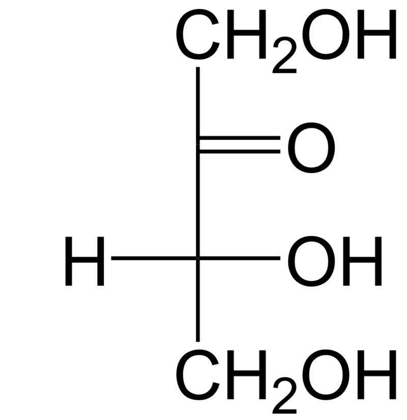
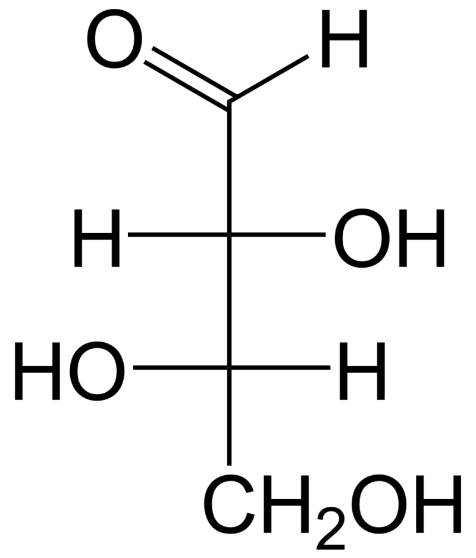
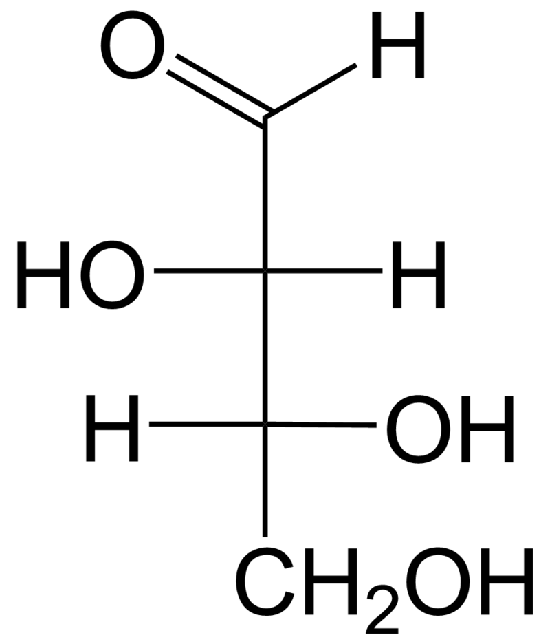
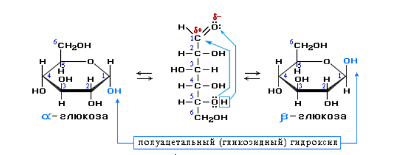

# Общая характеристика углеводов
- Углеводы-полигидроксикарбональные соединения и их производные. 
Углеводы подразделяются на:
- Моносахариды-негидролизующиеся углеводы, представляющие собой полигидроксиальдегиды(альдозы) и полигидроксикетоны(кетозы). 
- Дисахариды
- Полисахариды

### Изомерия углеводов - стереоизомерия 
Тетрозы — общее родовое химическое название класса четырехуглеродных моносахаридов, то есть сахаров, общей формулой которых является C4(H2O)4.
В зависимости от наличия кето- или альдогруппы различают кетотетрозы (единственный представитель эритрулоза) и альдотетрозы (два представителя: эритроза и треоза).
Различное расположение гидроксогруппы у 3 атома углерода у альдотероз отвечает D или L изомерам.

      L-эритрулоза

    D-эритрулоза

L-эритроза

D-эритроза

L-треоза

D-треоза

D и L изомеры одного соединения-энантиомеры.
- Энантиомеры-пара стереоизомеров, представляющих собой зеркальные отражения друг друга, не совмещаемые в пространстве.

D и D двух разных соединений-диастереомеры.
- Диастереомеры-стереоизомеры, не являющиеся зеркальными отражениями друг друга(оптические). Например D-эритроза и D-треоза.

### Образование циклических форм
- Циклические формы углеводов-продукты взаимодействия спиртового гидроксила и карбонильой группы-циклические полуацетали. 
  Если атака у 5 углерода-пиранозный цикл, у 4-фуранозный.
- Аномеры-стереоизомеры циклических форм моносахаридов, различающиеся положением только полуацетального гидроксила. 

### Классификация углеводов
1. По числу остатков простейших углеводов в молекуле: моносахариды(глюкоза, фруктоза, рибоза), олигосахариды(сахароза, мальтоза), полисахариды(крахмал, целлюлоза).
2. По функциональной группе: альдозы(содержат только альдегидную группу), кетозы(кетонная группа). 
3. По способности реагировать с реактивом Толленса или с Фелинговой жидкостью: восстанавливающие сахара(глюкоза) и невосстанавливающие(сахароза).
4. Другие признаки: сахароподобные(сахароза), несахараподобные(крахмал); пентозы и гексозы.